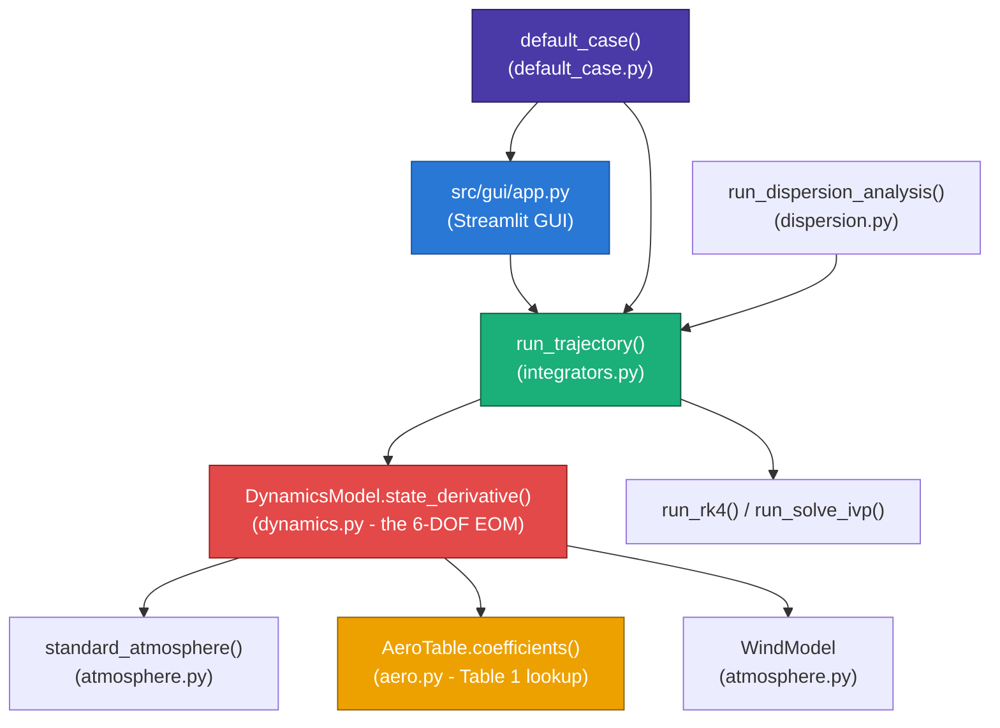

# RigidFlightLab

[](https://github.com/timeout187/RigidFlightLab/actions/workflows/tests.yml)
[](https://github.com/timeout187/RigidFlightLab/actions/workflows/publish-docker.yml)
[](https://www.python.org/downloads/)
[](LICENSE)
[](https://rigidflightlab.streamlit.app/)

**A 6-DOF spin-stabilized artillery projectile simulator**, reproducing
a published research paper's model, data, and results — built for
numerical-methods education, not operational use.

**Live app (no install needed): [rigidflightlab.streamlit.app](https://rigidflightlab.streamlit.app/)**

> **Academic simulation only.** No target-coordinate input, aim
> correction, weapon-deployment advice, or fire-control capability of
> any kind. Not validated for real-world use. See
> [docs/safety.md](docs/safety.md) for the full statement.

---

## Table of contents

1. [What is this?](#what-is-this)
2. [Key features](#key-features)
3. [Architecture](#architecture)
4. [Physics model](#physics-model)
5. [Project structure](#project-structure)
6. [Installation](#installation)
7. [Usage](#usage)
8. [Validation against the published paper](#validation-against-the-published-paper)
9. [Assumptions and limitations](#assumptions-and-limitations)
10. [Learn more](#learn-more)
11. [References](#references)
12. [Credits](#credits)
13. [License](#license)

---

## What is this?

RigidFlightLab simulates the full 6-degree-of-freedom flight of a
155&nbsp;mm spin-stabilized shell — position, velocity, spin, and
pitch/yaw wobble — from muzzle to impact, and reproduces the model,
155&nbsp;mm M107 example case, and Table 1 aerodynamic data of a real,
published paper (see [Credits](#credits)). It ships with a
browser-based GUI, so you can change any input and watch the
trajectory update, and a full test suite validating the result against
the paper's own published numbers.

## Key features

| Feature | Description |
|---|---|
| **Interactive GUI** | Streamlit dashboard: 3D trajectory + 6 time-history plots, CSV/JSON export |
| **Editable aerodynamics** | Table 1's Mach-indexed coefficients are editable in the GUI, with CSV upload/download to swap in a different projectile's data entirely |
| **Real 6-DOF rigid-body dynamics** | Full translational + rotational equations of motion, not a simplified point-mass model |
| **Mach & angle-of-attack indexed aero data** | Drag, lift, Magnus force/moment, overturning moment, and pitch/spin damping, all interpolated from the paper's own published table |
| **US Standard Atmosphere 1976** | Altitude-varying temperature, pressure, density, speed of sound, plus optional wind |
| **Two integrators** | Fixed-step RK4, or adaptive `scipy.integrate.solve_ivp` (RK45/DOP853/Radau/...) |
| **Monte Carlo dispersion analysis** | Sweeps all 8 of the paper's Table 2 uncertainty parameters (muzzle velocity, mass, inertia, spin, wind...) and reports impact-point spread |
| **Validated** | Reproduces the paper's own published flight time, summit altitude, deceleration, and pitch/velocity curves — see [Validation](#validation-against-the-published-paper) |

## Architecture



**Data flow**: the GUI (or a script) builds a `SimulationCase` from
`default_case()` plus any edited inputs → `run_trajectory()` dispatches
to the chosen integrator → at every step, `DynamicsModel.state_derivative()`
queries the atmosphere and aero table for the current altitude/Mach/
angle-of-attack, sums all aerodynamic forces and moments plus gravity,
and returns the 12-element state derivative → the integrator stops at
ground impact and returns the full time history.

## Physics model

### State vector (12 elements)

| Index | Variable | Description | Frame |
|---|---|---|---|
| 0-2 | x, y, z | Position (downrange, cross-range, altitude) | Inertial, z-up |
| 3-5 | u, v, w | Velocity | Non-rolling (aeroballistic) frame |
| 6-8 | phi, theta, psi | Roll angle; frame pitch, yaw | - |
| 9-11 | p, q, r | Spin rate; frame pitch, yaw rates | Non-rolling frame |

The **non-rolling frame** tracks the projectile's nose direction
(pitch/yaw) but does not rotate with its roll/spin — mathematically
exact for this axisymmetric shell (`Iyy = Izz`), and far cheaper to
integrate than a fully body-fixed frame, which would otherwise force
the solver to resolve the ~175 rev/s roll rate directly. See
[docs/model.md](docs/model.md) and [docs/equations.md](docs/equations.md)
for the full derivation.

### Translational dynamics

```
dV/dt |frame = F/m - Omega x V,      Omega = (0, q, r),  V = (u, v, w)
```

### Rotational dynamics (symmetric top, Iyy = Izz)

```
p_dot = Mx / Ixx
q_dot = (My - Ixx*p*r) / Iyy
r_dot = (Mz + Ixx*p*q) / Iyy
```

The `Ixx*p*r` / `Ixx*p*q` terms are the **gyroscopic coupling**: they
turn an aerodynamically *destabilizing* overturning moment (see below)
into bounded precession instead of a tumble, provided the spin rate is
high enough. This coupling is the entire reason spin-stabilization
works, and it's the part of the equations most worth understanding
before modifying this code — see the worked debugging story in
[docs/USER_MANUAL.md §2.8](docs/USER_MANUAL.md#28-validation-against-the-published-paper).

### Aerodynamic forces and moments

The paper's own equations (1)-(2) leave the aerodynamic terms as
generic symbols and don't spell out how they're computed from the
Table 1 coefficients - that data-to-force/moment relationship below is
standard aeroballistics practice (not text printed in the paper).
Given dynamic pressure `q_dyn = 0.5 * rho * V^2`, reference area `A`,
caliber `d`, and total angle of attack `alpha`:

```
Axial force (drag)   = q_dyn * A * (CA + CA_alpha2 * sin^2(alpha))
Normal force          = q_dyn * A * |CN_alpha| * sin(alpha)
Magnus force          = q_dyn * A * |C_Ypalpha| * (p*d/2V) * sin(alpha)
Overturning moment    = -q_dyn * A * d * Cm_alpha * sin(alpha)
Magnus moment         = -q_dyn * A * d * Cnpalpha(Mach, alpha) * (p*d/2V)
Pitch damping moment  =  q_dyn * A * d^2/(2V) * Cmq * (q or r)
Spin damping moment   =  q_dyn * A * d * (p*d/2V) * Clp
```

`CA`, `CA_alpha2`, `CN_alpha`, `Cmq`, `Cm_alpha`, `Clp`, `C_Ypalpha`,
and `Cnpalpha` are **Table 1** of the source paper — real, published,
Mach-indexed (and, for `Cnpalpha`, angle-of-attack-indexed) coefficient
data, not placeholder values. **`Cm_alpha` is positive** — the shell is
aerodynamically unstable on its own and relies entirely on gyroscopic
spin for stability, which is normal for a spin-stabilized (as opposed
to fin-stabilized) projectile.

### Atmosphere

| Layer | Altitude | Model |
|---|---|---|
| Troposphere | 0-11 km | Linear lapse rate, `T = 288.15 - 0.0065h` |
| Lower stratosphere | 11-20 km | Isothermal, `T = 216.65 K` |

Per the **US Standard Atmosphere 1976**; density and speed of sound
follow from the ideal gas law and `a = sqrt(gamma * R * T)`.

## Project structure

```
src/simulator/
  atmosphere.py     US Standard Atmosphere 1976 + wind model
  aero.py           Table 1 aero coefficients + Mach/alpha interpolation
  dynamics.py       the 6-DOF equations of motion (the physics core)
  integrators.py    RK4 + solve_ivp wrappers, ground-impact event
  dispersion.py     Monte Carlo dispersion sweep (paper's Table 2)
src/data/
  default_case.py   all input dataclasses + the paper's default values
src/gui/
  app.py            the Streamlit GUI
tests/              25 tests: atmosphere, aero, integrators, dispersion, validation
examples/           two ready-to-run example scripts
docs/
  USER_MANUAL.md    full guide: theory, usage, code reference, how to modify
  model.md          reference frames, aerodynamics, numerical integration, validation
  equations.md      the paper's equations, transcribed, mapped to the code
  safety.md         the full academic-use statement
  demo.html         static, no-install trajectory preview
wiki/               same docs, staged for the GitHub Wiki
Dockerfile, .github/workflows/  container image + CI, published to ghcr.io
```

## Installation

Requires **Python 3.10+**.

```bash
git clone https://github.com/timeout187/RigidFlightLab.git
cd RigidFlightLab
pip install -r requirements.txt
python -m pytest tests/ -q   # optional: verify the install, ~45s
```

## Usage

### Live app (no install needed)

**[rigidflightlab.streamlit.app](https://rigidflightlab.streamlit.app/)**
— the full GUI below, already running, in your browser.

### GUI (local)

```bash
streamlit run src/gui/app.py
```

Opens at `http://localhost:8501`. Edit the projectile, launch
conditions, aerodynamic table (see
[Editing the aerodynamic table](#editing-the-aerodynamic-table)),
atmosphere/wind, and solver settings in the sidebar, click **Run
simulation**, and get a 3D trajectory plus six time-history plots,
exportable as CSV/JSON. Enable the dispersion checkbox for a Monte
Carlo sensitivity sweep.

A static, no-install preview of the default trajectory is in
[docs/demo.html](docs/demo.html).

### Editing the aerodynamic table

The aero coefficient table in the GUI is a **live, editable** data
grid, not a fixed dataset:

1. Double-click any cell to change it, or use the row controls to
   add/remove Mach points.
2. Click **Run simulation** — your edits are what gets used.
3. **Upload a CSV** (matching column headers) to replace the whole
   table — useful for simulating a different shell's published data.
4. **Reset to paper defaults**, or **download your edits as CSV**, at
   any time with the buttons above the table.

To change the *default* table permanently (in code), see
[docs/USER_MANUAL.md §5.2](docs/USER_MANUAL.md#52-recipe-change-the-aerodynamic-table).

### Command line

```bash
python -m examples.nominal_run          # the paper's own example case
python -m examples.dispersion_example   # a 100-sample dispersion sweep
```

### Python API

```python
from src.data.default_case import default_case
from src.simulator.dynamics import DynamicsModel
from src.simulator.integrators import run_trajectory

case = default_case()
case.initial_conditions.elevation_angle_deg = 30.0   # change anything
model = DynamicsModel(case)
result = run_trajectory(model)
print(f"time of flight: {result.t[-1]:.1f} s, range: {result.state[-1, 0]:.0f} m")
```

### Docker

```bash
docker run -p 8501:8501 ghcr.io/timeout187/rigidflightlab:main
```

### Tests

```bash
python -m pytest tests/ -q
```

25 tests across atmosphere, aero interpolation, integrators,
dispersion, and validation against the paper's published numbers
(below) — runs in about 45 seconds.

## Validation against the published paper

With the default 155&nbsp;mm case and the paper's own Table 1 aero
data, this simulator reproduces the paper's Section 4.3 published
results closely. Values the paper states as exact text:

| Quantity | Paper (exact quote) | This simulator |
|---|---|---|
| Time of flight | "66.67 sec" | ~66.4 s |
| Summit time | "nearly 31 s" | ~30.5 s |
| Initial axial deceleration | "4.45g" | ~-4.47 g |

Values read visually off the paper's own figures (not printed as
exact numbers, so treat these as approximate chart readings):

| Quantity | Paper (~, from chart) | This simulator |
|---|---|---|
| Summit altitude (Fig. 4) | ~5750 m | ~5630 m |
| Pitch angle at impact (Fig. 8) | ~-55&deg; | ~-58&deg; |
| Max total angle of attack (Fig. 10) | ~1.3&deg; | ~1.7&deg; |
| Min / impact velocity (Fig. 5) | ~250-300 / ~330 m/s | ~253 / ~329 m/s |
| Range (Fig. 3) | ~16-17 km | within ~10-15% |

Full table and discussion:
[docs/model.md#validation-against-the-published-results](docs/model.md#validation-against-the-published-results).

## Assumptions and limitations

**What this model includes:**

- Full 6-DOF rigid-body dynamics (not a point-mass approximation)
- Mach- and angle-of-attack-indexed aerodynamic coefficients (the
  paper's own published Table 1, not a generic estimate)
- Gyroscopic spin-stabilization (overturning moment + gyroscopic
  coupling), the physical mechanism that actually keeps the shell
  flying straight
- Magnus force and moment, pitch damping, spin damping
- Altitude-varying atmosphere (US Standard Atmosphere 1976) and
  optional wind
- Monte Carlo dispersion sensitivity analysis (the paper's own Table 2
  uncertainty parameters)

**What this model deliberately omits** (physics simplifications, not
missing features to add later):

- Earth's rotation (Coriolis/Eotvos effects) and oblate-Earth
  geometry — the source paper's own equations (3)-(4) include these;
  this project uses a flat, non-rotating Earth, appropriate for this
  example's range/altitude regime
- Projectile structural flexibility, base-drag variation from base
  bleed/rocket assist

**What this project will never include, by design** (see
[docs/safety.md](docs/safety.md)):

- Target-coordinate input, aim correction, or fire-control solutions
- Live-fire recommendations or artillery firing-table generation
- Any real-world weapon-deployment or targeting capability

## Learn more

- **[docs/USER_MANUAL.md](docs/USER_MANUAL.md)** — the full guide for
  PhD/MSc/research students: theory, GUI walkthrough, a complete
  function-by-function code reference, and how to modify the project
  and contribute changes back through GitHub.
- [docs/model.md](docs/model.md) — reference frames, aerodynamics,
  numerical integration, and the validation table in full.
- [docs/equations.md](docs/equations.md) — the paper's equations of
  motion, transcribed, mapped exactly to the code.
- [docs/safety.md](docs/safety.md) — the full academic-use statement.

## References

1. Khalil, M., Abdalla, H., and Kamal, O., *"Dispersion Analysis for
   Spinning Artillery Projectile"*, 13th International Conference on
   Aerospace Sciences & Aviation Technology (ASAT-13), Paper
   ASAT-13-FM-03, Military Technical College, Cairo, Egypt, May 2009.
   **The paper this project reproduces.**
2. Etkin, B., *Dynamics of Atmospheric Flight*, John Wiley & Sons,
   1972. (Cited by [1] as the source of its 6-DOF formulation.)
3. *U.S. Standard Atmosphere, 1976*, jointly published by
   NOAA/NASA/USAF - the standard model implemented in
   `src/simulator/atmosphere.py`. Not cited by [1], which uses its own
   unspecified atmospheric model.

## Credits

This project reimplements the 6-DOF equations of motion, 155&nbsp;mm
M107 example case, and Table 1 aerodynamic coefficients of reference
[1] above as open-source, runnable code with an interactive GUI — full
credit for the underlying research and data to **Mostafa Khalil, H.
Abdalla, and Osama Kamal** (Military Technical College, Cairo, Egypt).

**Built with:** [Streamlit](https://streamlit.io),
[Plotly](https://plotly.com), [SciPy](https://scipy.org), and
[NumPy](https://numpy.org).

**Project by [Hasan Ahmed](https://github.com/timeout187)**, built
with Claude.

## License

[MIT](LICENSE) — see the license file for the full text and copyright.
